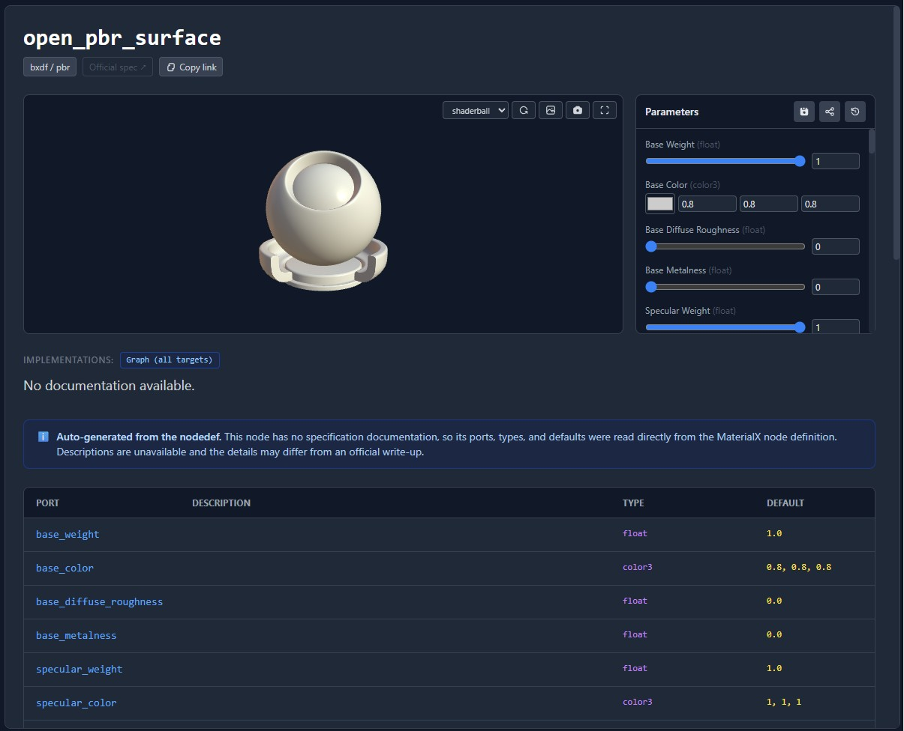
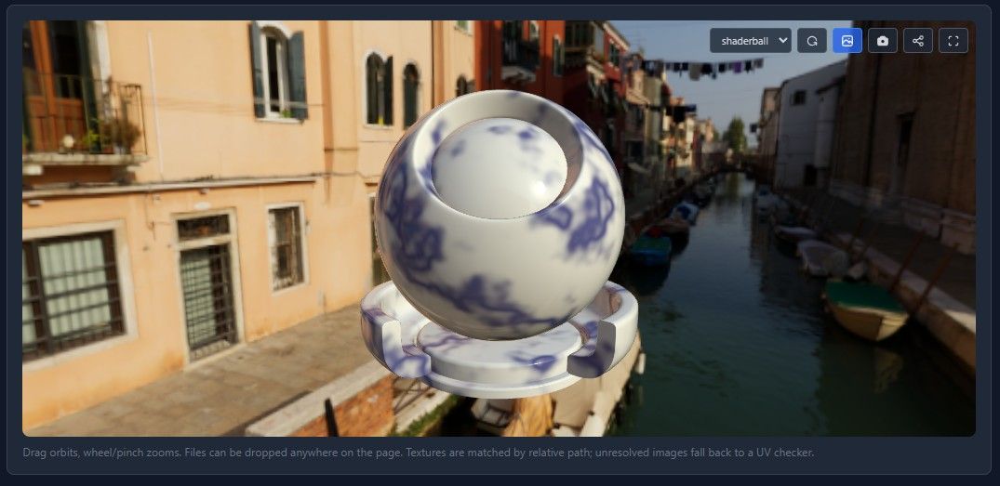
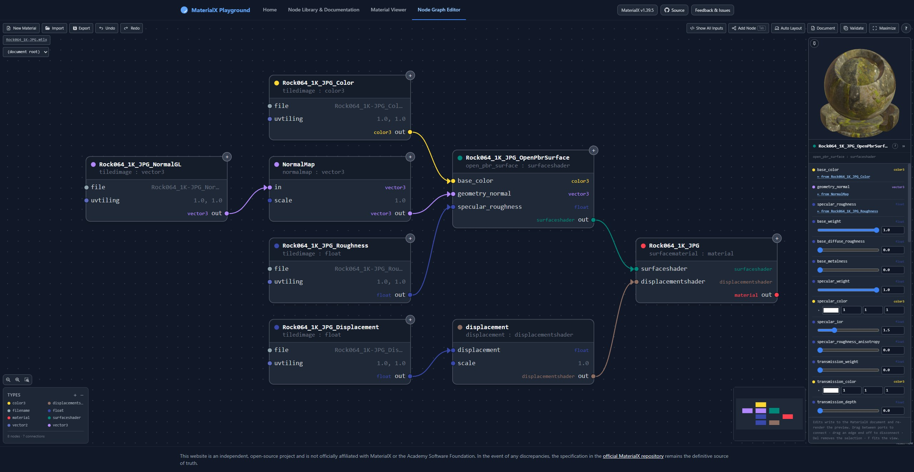

# MaterialX Playground

An interactive, open-source, in-browser playground for MaterialX™: browse the standard node library, preview materials in real-time 3D, and build node graphs visually, all without installing anything. Everything runs client-side. Shaders are generated and compiled live in your browser through the MaterialX WebAssembly modules.

> This is an independent community project. It is **not affiliated with, endorsed by, or sponsored by** the [MaterialX](https://materialx.org/) project, the Academy Software Foundation, or the Linux Foundation. In case of any discrepancy, the [MaterialX specification](https://github.com/AcademySoftwareFoundation/MaterialX/tree/main/documents/Specification) is the definitive source of truth. See [Trademarks](#trademarks) below.

Built against MaterialX v1.39.5.

---

## Features

The app is a single page with three tools, switched via a top nav bar and reachable at stable URLs. A landing home page introduces them.

### 📖 Node Library & Documentation



A searchable, browsable reference for the entire MaterialX standard node library.

- **Every standard node**, organized by library (`stdlib`, `pbrlib`, `bxdf`, and more) and group.
- **Per-signature documentation.** Nodes with multiple type signatures (overloads) are shown individually, so you see exactly the inputs, outputs, and defaults of the variant you care about.
- **Port tables** generated directly from the node definitions (names, types, defaults, descriptions), with prose pulled from the MaterialX specification where available and reconstructed from the `nodedef`s where it isn't.
- **Live 3D preview** of each node, rendered on a sphere, cube, or shaderball, with editable parameters so you can see how inputs affect the result in real time.
- **Implementation-target matrix** showing which render targets (GLSL, ESSL, MSL, Slang, OSL, MDL) each node supports, including coverage inherited through target inheritance (e.g. MSL/Slang/ESSL falling back to the GLSL implementation), distinguished from explicit per-target overrides.
- **Shareable permalinks.** Every node has its own URL (`index.html#/<library>/<group>/<node>`), so you can link straight to a specific node's docs.
- **Export and hand-off.** Export any node (with your edited values) as a `.mtlx` document, or send it straight into the Node Graph Editor.

### 🖼️ Material Viewer



Load and inspect complete MaterialX materials in 3D. Opens with the OpenPBR default material so there is something to look at right away.

- **Real-time shader generation.** MaterialX source is compiled to a live GLSL shader in the browser by the WASM shader generator.
- **Image-based lighting** from a built-in HDR environment (always on). A toggle shows or hides that environment as the visible backdrop; the lighting itself is unaffected either way.
- **Drag-and-drop loading.** Drop a `.mtlx` document anywhere on the page, on its own or together with loose textures, a folder of textures, or a `.zip`. Textures are matched by relative path, with a UV-checker fallback for anything unresolved.
- **Interactive viewport** with orbit (drag) and zoom (wheel/pinch), an optional turntable rotation, selectable preview geometry (shaderball / sphere / cube), a material picker when a document defines several, a save-PNG-preview button, and fullscreen.
- **Send to editor** to keep working on the current material in the Node Graph Editor.

### 🕸️ Node Graph Editor



Build MaterialX node graphs visually.

- **Drag-and-drop graph editing** built on React Flow, with an add-node search (filterable by type) and automatic wiring.
- **Quick insert from a wire.** Drag a connection from any port and release it over empty canvas to pick a compatible node, pre-filtered and wired up automatically.
- **Nested nodegraphs.** Enter and edit nodegraph scopes with breadcrumb navigation back out, and group the current selection into a new nodegraph in one step.
- **Undo/redo** across edits, including structural ones.
- **Live 3D preview** of the selected node or output, with a pin option to freeze the preview on a specific node while you work elsewhere.
- **Copy/paste** that preserves the relative arrangement of a group of nodes.
- **One-click automatic layout** of the current graph.
- **Document colorspace picker**, setting the fallback colorspace for inputs that don't author their own.
- **Non-destructive disconnects.** Removing a connection or deleting an upstream node restores the input's previous literal value where possible, and falls back to the definition default otherwise.
- **Document view** to inspect the generated MaterialX XML with syntax highlighting, and copy it.
- **Validate** the current document and see errors and warnings.
- **Import/export** `.mtlx`, including materials handed off from the docs previewer or the Material Viewer.

### Across the whole app

- 100% client-side: no server, no account, no data leaves your browser.
- Built on the MaterialX WebAssembly modules (core and shader generation).
- Consistent dark UI, keyboard shortcuts in the editor (the "?" button in the graph view lists them), and a mobile-friendly, collapsible header.
- A shared, instantly-painting site header/footer, so switching between tools feels like one app rather than three page loads.

---

## Getting started

There is no build step. The app is plain static files plus CDN-hosted libraries, so you just need to serve the folder over HTTP (opening `index.html` directly via `file://` won't work, because the app fetches its `.jsx`, WASM, and library files). You'll need a WebGL2-capable browser, and internet access at runtime since the third-party libraries load from public CDNs.

Any static file server works, for example:

```bash
# Python 3
python -m http.server 8000

# or Node
npx serve .
```

Then open <http://localhost:8000/>.

### URLs / routing

The app is a hash-routed single page:

| View | URL |
| --- | --- |
| Home | `index.html` (or `#!home`) |
| Node Library & Documentation | `index.html#!docs` (deep links: `#/<library>/<group>/<node>`) |
| Material Viewer | `index.html#!viewer` |
| Node Graph Editor | `index.html#!graph` |

The legacy standalone pages (`material-viewer.html`, `node-graph.html`, `app.html`) are thin redirect stubs into the corresponding hash route, so old links keep working.

### Debugging

Verbose console output is off by default. Two opt-in flags can be set in the browser console (reload afterwards):

```js
localStorage.setItem('mtlxDebugShaders', '1'); // log generated GLSL, uniforms, and preview documents
localStorage.setItem('mtlxPerfLog', '1');      // log graph-editor timing (scope builds, layout, previews)
```

Remove the keys (`localStorage.removeItem(...)`) and reload to turn them off again.

---

## How it works

- **`index.html`** is the single entry point. It loads the shared engine and the shell, then mounts a React app into `#root`.
- **`js/shell.jsx`** is a lazy-loading, keep-alive multi-view shell. A lightweight hash router selects the active view; each view's CDN/local dependencies are fetched only the first time that view is opened, and views stay mounted (hidden) afterward so switching back is instant and preserves state.
- **`js/mtlx-engine.js`** is the shared core, loaded eagerly: it initializes the MaterialX WASM (core + shader generator), loads the standard libraries, and exposes shared helpers and the icon set used across every view.
- **`js/site-header.js`** builds the shared header + footer as plain HTML (no framework), injected synchronously so the chrome paints instantly and identically on every view.
- The three tools live in **`js/docs-app.jsx`**, **`js/viewer-app.jsx`**, and **`js/graph-app.jsx`** (its node model/canvas/dialogs/panels split across **`js/graph/`**), with **`js/home-app.jsx`** for the landing page. **`js/shared/mtlx-ui.jsx`** holds UI glue shared by all three views. The docs view's presentational pieces live in **`js/docs/`** (permalink/spec-link helpers, rich-text and math rendering, port tables, the implementation matrix, and the sidebar/help dialog) plus **`js/node-preview.jsx`** for the live 3D preview.
- Because the app has no bundler, files share code exclusively through explicit `window.*` exports; there are no ES modules.

### The standard library and spec data

- **`libraries/`** vendors the MaterialX standard library (`stdlib`, `pbrlib`, `bxdf`, `cmlib`, `lights`, `nprlib`, `targets`), which the WASM loads to resolve node definitions, implementations, and target inheritance.
- **`spec_parser.py`** pre-processes the MaterialX specification into the Markdown docs (`MaterialX.StandardNodes.md`, `MaterialX.PBRSpec.md`, `MaterialX.NPRSpec.md`) that the docs view reads for prose descriptions.
- Environment maps (`.hdr`) provide image-based lighting for the 3D previews.

---

## Tech stack

- [MaterialX](https://github.com/AcademySoftwareFoundation/MaterialX) (WebAssembly build: core + GenShader)
- [React 18](https://react.dev/) (UMD) + [Babel Standalone](https://babeljs.io/docs/babel-standalone) (in-browser JSX)
- [three.js](https://threejs.org/) for the 3D previews
- [React Flow](https://reactflow.dev/) for the node graph editor, with [dagre](https://github.com/dagrejs/dagre) for automatic layout
- [Tailwind CSS](https://tailwindcss.com/) (CDN) for styling
- [KaTeX](https://katex.org/) for math in the docs, [highlight.js](https://highlightjs.org/) for XML highlighting, [JSZip](https://stuk.github.io/jszip/) for zipped texture sets

All third-party libraries are loaded from public CDNs at runtime.

---

## Contributing

Issues and pull requests are welcome. Please file bugs and feature requests via the [issue tracker](https://github.com/joaovbs96/MaterialXNodeDocs/issues).

## License

Released under the [Apache License 2.0](LICENSE). The MaterialX standard libraries vendored under `libraries/` are © the Academy Software Foundation and its contributors, also under the Apache License 2.0.

## Trademarks

MaterialX™ is a trademark of the Academy Software Foundation, a project of the Linux Foundation. All other trademarks are the property of their respective owners.

References to MaterialX in this project are nominative and descriptive only, used to identify the technology this tool works with. This project is **not affiliated with, endorsed by, or sponsored by** the MaterialX project, the Academy Software Foundation, or the Linux Foundation. This project does not use the MaterialX logo, and nothing here should be read as implying any official status. Where this document and any policy published by the Academy Software Foundation differ, the Foundation's policy governs.
